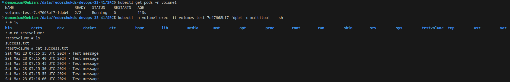
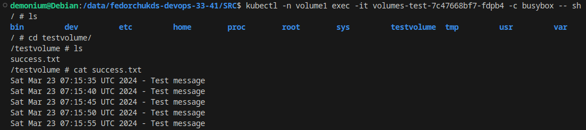
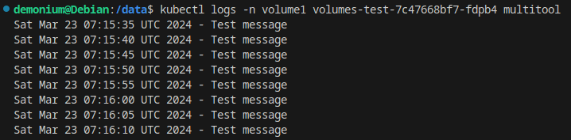
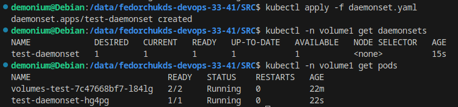
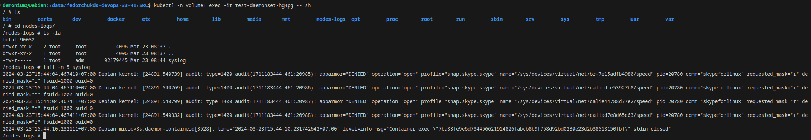

# Автор: Федорчук Дмитрий Сергеевич DEVOPS-33

# Домашнее задание к занятию «Хранение в K8s. Часть 1»

### Задание 1 

**Что нужно сделать**

Создать Deployment приложения, состоящего из двух контейнеров и обменивающихся данными.

1. Создать Deployment приложения, состоящего из контейнеров busybox и multitool.
2. Сделать так, чтобы busybox писал каждые пять секунд в некий файл в общей директории.
3. Обеспечить возможность чтения файла контейнером multitool.
4. Продемонстрировать, что multitool может читать файл, который периодоически обновляется.
5. Предоставить манифесты Deployment в решении, а также скриншоты или вывод команды из п. 4.

------

### Задание 2

**Что нужно сделать**

Создать DaemonSet приложения, которое может прочитать логи ноды.

1. Создать DaemonSet приложения, состоящего из multitool.
2. Обеспечить возможность чтения файла `/var/log/syslog` кластера MicroK8S.
3. Продемонстрировать возможность чтения файла изнутри пода.
4. Предоставить манифесты Deployment, а также скриншоты или вывод команды из п. 2.

------

### Выполнение задания 1

1. Пишу Deployment приложения, состоящего из контейнеров busybox и multitool.

2. Чтобы busybox писал данные каждые пять секунд в некий файл в общей директории, буду использовать команду создающую общую директорию и общий файл. Далее в созданный файл каждые пять секунд будет записываться сообщение "Test message".

3. Для обеспечения чтения файла контейнером multitool, в манифесте Deployment укажу общую с контейнером busybox директорию, читать файл буду с помощью команды `tail`.

4. Проверю, запишутся ли данные в файл контейнером busybox и будут ли они доступны контейнеру multitool.

Сделать это можно как из самих контейнеров, так и посмотрев их логи.

Проверю данные из контейнеров:

Из обоих контейнеров пода файл виден, доступен, в него действительно записываются данные каждые 5 секунд.

Также можно проверить, читает ли контейнер multitool файл success.txt, посмотрев его лог:

Видно, что контейнер multitool читает файл.

5. Ссылка на манифест Deployment - https://github.com/DemoniumBlack/fedorchukds-devops-33-41/blob/main/SRC/deployment.yaml

------

### Выполнение задания 2

1. Пишу манифест DaemonSet приложения, состоящего из multitool. Применяю манифест и проверяю DaemonSet и Pod:

2. Для обеспечения возможность чтения файла `/var/log/syslog` кластера MicroK8S внутри контейнера буду использовать параметр subPath, который позволит монтировать не всю директорию /var/log c машины - кластера MicroK8S, а именно один файл syslog. Также буду использовать параметр readOnly, чтобы избежать проблем с доступом к файл syslog, находящемуся на машине - кластере MicroK8S.

3. Проверю возможность чтения файла изнутри пода:

Видно, что в контейнере пода присутствует директория /nodes-logs/ с файлом syslog, который примонтирован из машины - кластера MicroK8S.

4. Ссылка на манифест DaemonSet - https://github.com/DemoniumBlack/fedorchukds-devops-33-41/blob/main/SRC/daemonset.yaml